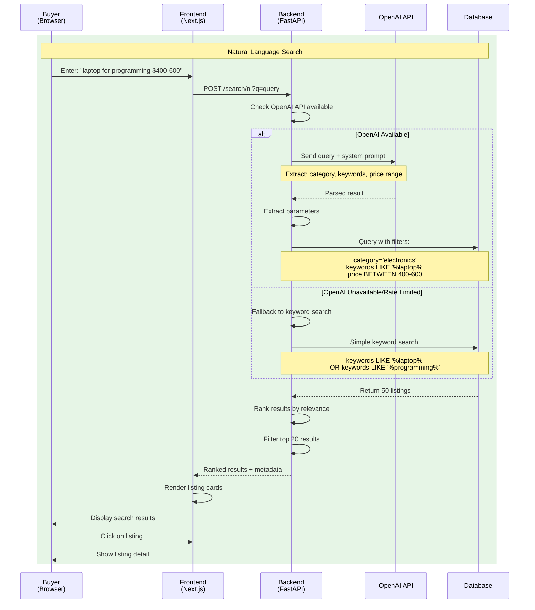

# Campus Marketplace (Campify) - UML & Sequence Diagrams

---

## 1. Class Diagram - Data Models

---

## 2. Component Diagram - System Architecture

---

## 3. Deployment Diagram - Production Architecture

---

## 4. Sequence Diagram - User Registration & Login

---

## 5. Sequence Diagram - Create Listing

---

## 6. Sequence Diagram - Search with NLP

---

## 7. Sequence Diagram - Real-Time Chat

---

## 8. Sequence Diagram - Admin Moderation

---

## 9. Activity Diagram - Marketplace Search Flow

---

## 10. State Diagram - Listing Lifecycle

---

## 11. Sequence Diagram - Authentication & Authorization

---

## 12. Entity Relationship Diagram (ERD)

---

## 13. Use Case Diagram

---

## 14. Sequence Diagram - File Upload & Storage

---

## 15. State Diagram - User Authentication States

---

## Summary of Diagrams

| Diagram | Type | Purpose |
|---------|------|---------|
| 1. Class Diagram | Static | Shows data models and relationships |
| 2. Component Diagram | Static | Shows system components and layers |
| 3. Deployment Diagram | Static | Shows cloud infrastructure |
| 4. Registration/Login Sequence | Dynamic | User onboarding flow |
| 5. Create Listing Sequence | Dynamic | Seller creates marketplace item |
| 6. NLP Search Sequence | Dynamic | AI-powered search process |
| 7. Chat Sequence | Dynamic | Real-time WebSocket messaging |
| 8. Admin Moderation Sequence | Dynamic | Content moderation workflow |
| 9. Search Activity Diagram | Dynamic | Marketplace search logic |
| 10. Listing State Diagram | State | Lifecycle of a listing |
| 11. Authentication Sequence | Dynamic | JWT token validation |
| 12. Entity Relationship Diagram | Static | Database schema visualization |
| 13. Use Case Diagram | Static | User interactions |
| 14. File Upload Sequence | Dynamic | Photo upload process |
| 15. Auth State Diagram | State | User authentication states |

---

**Document Version:** 1.0  
**Date:** December 4, 2025  
**Project:** Campus Marketplace (Campify) - CMPE 202
