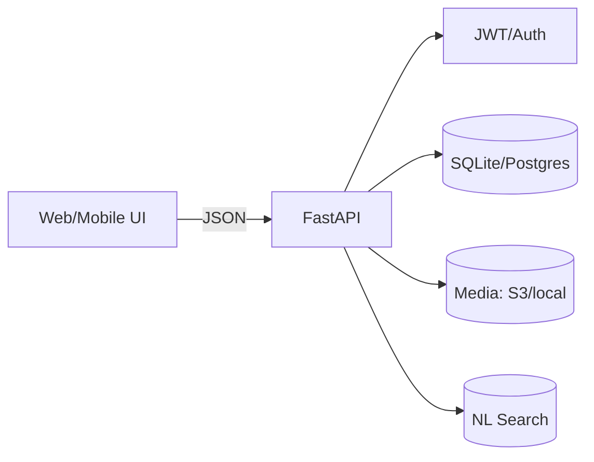
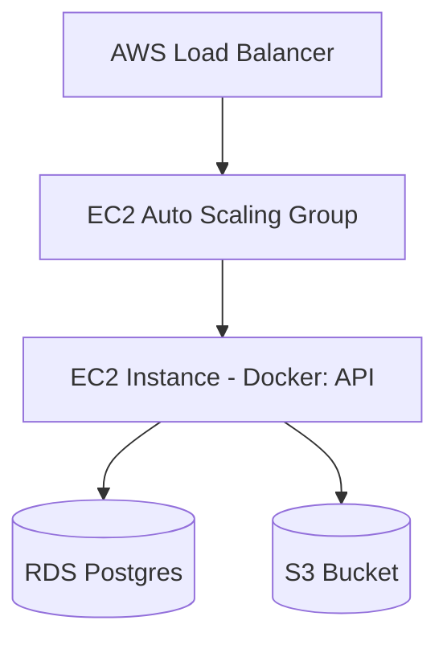

# Architecture Diagrams (Mermaid)

## Component Diagram

```mermaid
flowchart LR
UI[Web/Mobile UI]
API[FastAPI]
Auth[JWT/Auth]
DB[(SQLite/Postgres)]
Storage[(Media: S3/local)]
OpenAI[(NL Search)]

UI -->|JSON| API
API --> Auth
API --> DB
API --> Storage
API --> OpenAI
```

## Deployment Diagram

```mermaid
flowchart TB
ALB[AWS Load Balancer]
ASG[EC2 Auto Scaling Group]
EC2A[EC2 Instance - Docker: API]
RDS[(RDS Postgres)]
S3[(S3 Bucket)]

ALB --> ASG
ASG --> EC2A
EC2A --> RDS
EC2A --> S3
```
